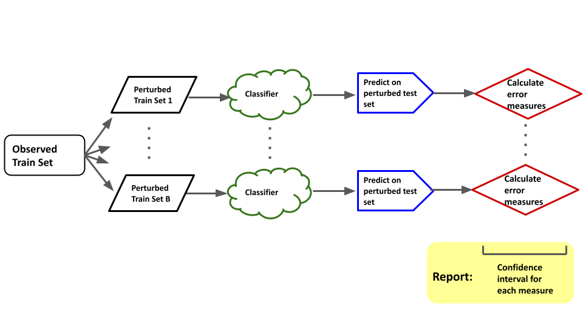

```{r global_options, include = FALSE}
knitr::opts_chunk$set(echo = FALSE,
                      warning = FALSE,
                      message = FALSE,
                      fig.width = 6,
                      fig.height = 4)
```

```{r include=FALSE}
library(tidyverse)
library(mvtnorm)
library(data.table)
library(knitr)
library(randomForest)
library(kableExtra)
set.seed(3)
```

(this slide is blank)

## Agenda

- Introduction to Measurement Error
- Toy Example
- Gaussian Perturbation Pipeline
- Application to Toy Example
- Application to Astronomy Data


# Introduction

## What is measurement error?

**Measurement error** is the difference between a measured quantity and its true value.

. . .

In many statistical scenarios, we assume that our variables are perfect measurements from some sample.

. . .

This is often **false**. In many cases, we know our measurements are inaccurate.

. . .

In especially nice cases, we know **how inaccurate** they are.

. . .

**Question:** Can we make use of known measurement error?

## Applications of Measurement Error

Situations where we know our measurement error include:

- Astronomy data
  - We'll come back to this.
- Privacy applications
  - Intentionally adding noise to observations is a common method for achieving privacy. We choose the amount of noise to add.
- Various scientific and engineering settings

# Toy Example

## Toy Example: Setup

- Two classes, mostly separable.
- $\mathbf X_i$ represents the true values.
  -  In practice, these might be individuals in a study, astronomy objects, etc.
- $\varepsilon_i$ is the known measurement error.

$$
\begin{aligned}
\mathbf X_{1}, \dots, \mathbf X_{250} &\sim \text{i.i.d. } \mathcal N \left( \begin{bmatrix} 1 \\ 2 \end{bmatrix}, \begin{bmatrix} 3 & -0.5 \\ -0.5 & 2 \end{bmatrix} \right) \\
\mathbf X_{251}, \dots, \mathbf X_{500} &\sim \text{i.i.d. }\mathcal N \left( \begin{bmatrix} -1 \\ -1 \end{bmatrix}, \begin{bmatrix} 4 & -1 \\ -1 & 1 \end{bmatrix} \right) \\
\varepsilon_i &\sim \text{i.i.d. } \mathcal N \left( \begin{bmatrix} 0 \\ 0 \end{bmatrix}, \begin{bmatrix} 1 & 0 \\ 0 & 3 \end{bmatrix} \right)
\end{aligned}
$$

```{r echo=F, warning=F}
toy <- new.env()
source("../Toys/svm_measurement_error_toy.R", toy)
attach(toy)

data <- make_base_data()
#kable(data %>% select(x1, x2) %>% add_column(error1 = 1, error2 = 3) %>% head(4), digits = 3)
```

## Toy Example: The True Values

These are our simulated true $\mathbf X$ values:

```{r echo=F, warning=F, fig.width=5, fig.height=3}
plot_data_with_error(data)
```

---

## Toy Example: The Measured Values

These are the measured values, $\mathbf X + \varepsilon$:

```{r echo=F, fig.width=5, fig.height=3}
noisy <- noisify_data(data)
plot_data_with_error(noisy)
```

## Toy Example: Classifier Performance

Fitting a linear SVM (tuned using 10-fold CV) to the above yields the following accuracies:

```{r include=F}
d_acc <- 100*svm_metrics(data)$accuracy
n_acc <- 100*svm_metrics(noisy)$accuracy
```

Dataset  | Accuracy
---------|------------
True     | `r sprintf("%0.1f", d_acc)`%
Measured | `r sprintf("%0.1f", n_acc)`%

. . .

**Can we trust this accuracy estimate having only observed one set of noisy measurements?**

## Toy Example: Simulating Measurement Error

Using the same original dataset, we simulate taking noisy measurements and fitting the SVM 500 times to obtain the following distribution of classifier accuracy:

```{r cache=T, echo=F, fig.width = 4, fig.height = 1.5}
# simulate measurement error on one clean observation
sim_results_me <- run_simulations(data, 500, 1)

# simulate measurement error on one noisy observation
sim_results_noisy <- run_simulations(noisy, 500, 1)

#ggplot(sim_results_me) + geom_histogram(aes(x = accuracy), binwidth = 0.01, color = #"#000000", fill= "#ffaa33", size = .25) +
#  xlab("Accuracy") +
#  ylab("Frequency") +
#  theme_bw(base_size = 8)

ggplot(sim_results_me) + geom_boxplot(aes(y = accuracy), fill = "#ffaa33", size = 0.25) +
  ylab("Accuracy") +
  coord_flip() +
  theme_bw(base_size = 8) +
  theme(axis.text.y = element_blank())

detach(toy)
```

That is, we might observe this distribution if we could take 500 sets of measurements.

---

\LARGE Can we estimate that distribution if we only observe one set of measurements?

# Gaussian Perturbation Pipeline

## What do we want?

- A method to estimate uncertainty in classification performance that can be used for any classifier.

. . .

- **Our project:** use Gaussian perturbation based on known measurement error

. . .

- **Result:** confidence intervals for any performance measure

. . .

- **Bonus:**
  - quantify algorithm stability
  - algorithm selection
  - probabilities for each observation (think, soft classifier)

## How do we do it?



# Application to Toy Example

## Toy Example: Estimating Variance Without the True Values

```{r echo=F, fig.height = 3}
attach(toy)

ggplot(bind_rows(
  sim_results_me %>% add_column(observed = "500 Sets of Measurements"),
  sim_results_noisy %>% add_column(observed = "500 Perturbations of 1 Set of Measurements")
)) +
  geom_boxplot(aes(x = observed, y = accuracy), fill = c("#999999", "#ffaa33")) +
  xlab(" ") +
  ylab("Accuracy") +
  coord_flip() +
  theme_bw(base_size = 8)
```

- The standard deviation when taking 500 sets of measurements (what we want to estimate) is `r sprintf("%0.5f", sd(sim_results_me$accuracy))`.
- The standard deviation when performing Gaussian perturbation on one set of measurements is `r sprintf("%0.5f", sd(sim_results_noisy$accuracy))`.

## Toy Example: A Decision Boundary for Each Perturbed Dataset

```{r echo=F}
plot_data_with_decision_boundaries(noisy, sim_results_noisy)
```

## Toy Example: Purple Points

Averaging predictions over those 500 decision boundaries yields a softened classifier:

```{r}
classified <- soft_classify_set(sim_results_noisy, noisy)

ggplot(classified) +
  geom_point(aes(x = x1, y = x2, color = p)) +
  scale_color_gradient(low = "#cc0011", high = "#223399") +
  xlim(-10, 10) +
  ylim(-10, 10)

# KILL THE TOY
detach(toy)
```

# Application to Real Data

```{r, include = F}
train.set1 <- fread("../Data/train_set1.csv")
train.set2 <- fread("../Data/train_set2.csv")
test.set <- fread("../Data/test_set.csv")

# combine training sets
train.set <- rbind(train.set1, train.set2)

# convert class to factor
train.set$class <- as.factor(train.set$class)
test.set$class <- as.factor(test.set$class)
```


## Astronomy Data

- **Source:** Sloan Digital Sky Server (SDSS) Data Release #12
- **Variables:** PSF magnitude in 5 wavelengths (UV, green, red, near-IR, IR)
- **Response:** Object class (star, galaxy)

. . .

- Around 250,000 objects
- 70/30 train/test random split
- Note: we have slight class imbalance

```{r, echo = F}
class.tbl <- prop.table(table(c(train.set$class, test.set$class)))
names(class.tbl) <- c("Galaxy", "Star")
class.tbl %>% t %>% kable("latex", caption = "Class proportions of  full dataset", booktabs = T)
```


## Perturbing Astro Data
- 500 perturbed sets
- Classifier: Random Forest
- Reported measures: Accuracy, AUC, Sensitivty, Specificity, F score

{width=60%}

## Results: Confidence intervals

**Idea:** Use standard deviation from perturbed results as the estimated standard error for the distribution of these measures.

. . .

```{r, include = F}
# reference RF
load("../Data/reference_rf_measures.RData")
```

```{r, echo = F}
meas <- fread("../Data/measures500.csv")
meas.sd <- apply(meas, 2, sd)

lower <- (rf.meas - 2*meas.sd) %>% round(4)
upper <- (rf.meas + 2*meas.sd) %>% round(4)

sprintf("(%0.4f, %0.4f)", lower, pmin(1, upper)) %>%
  matrix(nrow = length(rf.meas), dimnames = list(names(rf.meas), "95% CI")) %>%
  kable("latex", booktabs = T) %>%
  kable_styling(font_size = 10)

#quantile(meas$AUC, 0.025)
#quantile(meas$AUC, 0.975)
```

. . .

**Limitation:** Values particularly close to 0 or 1 are likely to produce invalid confidence intervals.

## Bonus Results: Probabilities

Vote count and probabilities for a selection of observations based on 500 perturbations.

```{r, echo = F}
counts <- fread("../Data/counts_prob.csv")
counts <- cbind(1:nrow(counts), counts)
names(counts) <- c("Observation ID", "Galaxy Votes", "Star Votes", "P(Galaxy)")

head(counts) %>% kable("latex", booktabs = T) %>% kable_styling(position = "center")
```

# Discussion

## Summary

- Uncertainty of performance as a "function" of known measurement error
- Stablility of class labels
- Algorithm selection

## Future Directions + Related Work

- How do we construct confidence intervals when values are near 1?
- Can we use these results to improve classifier prediction (e.g., ensemble methods)?
- Extend these results to clustering setting...

# Questions?

## Works Cited

\fontsize{8}{8}\selectfont

<!-- Put BibTeX entries in sources.bib, and they'll magically appear here. -->
