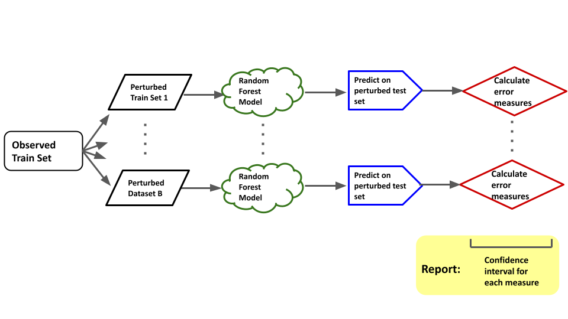

```{r include=FALSE}
library(tidyverse)
library(mvtnorm)
set.seed(3)
```

(this slide is blank)

# Introduction

## What is measurement error?

**Measurement error** is the difference between a measured quantity and its true value.

. . .

In many statistical scenarios, we assume that our variables are perfect measurements from some sample.

. . .

This is often **false**. In many cases, we know our measurements are inaccurate.

. . .

In especially nice cases, we know **how inaccurate** they are.

## Applications of Measurement Error

Situations where we know our measurement error include:

- Astronomy data (we'll come back to this)
- Privacy applications
  - Intentionally adding noise to observations is a common method for achieving privacy. We choose the amount of noise to add.
- Earthquake data?
  - Would need to ask our friend Ian Lee about this.
- Many instruments used for measurement.

## Toy Example: Setup

Mostly separable classes. No measurement error.

- 500 observation
- 2 classes:
$X_{1}, \dots, X_{250} \sim N(\mu_1, \Sigma_1)$
$X_{251}, \dots, X_{500} \sim N(\mu_2, \Sigma_2)$
$\epsilon \sim N(\mathbf0, 1 0 0 3)$ **all this needs fixed**

x | y | errX | errY
----|----|----|----
34.4 | 12 | 1 | 2
34.4 | 12 | 1 | 2

---

## Toy Example: A Clean Dataset (remove this slide?)

```{r echo=F, warning=F}
toy <- new.env()
source("../Toys/svm_measurement_error_toy.R", toy)
attach(toy)

data <- make_base_data()
plot_data(data)
```

## Toy Example: A Clean Dataset

Simulated data with known measurement error

```{r echo=F, warning=F}
plot_data_with_error(data)
```

---

## Toy Example: Noisy Dataset

After Gaussian perturbation:

```{r echo=F}
noisy <- noisify_data(data)
plot_data(noisy)
```

## Toy Example: Classifier Performance

Fitting a basic linear SVM to the above yields the following accuracies:

```{r include=F}
d_acc <- 100*svm_metrics(data)$accuracy
n_acc <- 100*svm_metrics(noisy)$accuracy
```

Clean Dataset | Noisy Dataset
-------------|----------------
`r sprintf("%0.1f", d_acc)`% | `r sprintf("%0.1f", n_acc)`%

. . .

**Can we trust this accuracy estimate having only observed one set of measurements?**

## Toy Example: Simulating Measurement Error

Using that same original dataset, we repeat this process 500 times to obtain the following distribution of classifier accuracy:

```{r cache=T, echo=F}
# simulate measurement error on one clean observation
sim_results_me <- run_simulations(data, 500, 1)

# simulate measurement error on one noisy observation
sim_results_noisy <- run_simulations(noisy, 500, 1)

ggplot(sim_results_me) + geom_histogram(aes(x = accuracy), binwidth = 0.01, color = "#000000", fill= "#ffaa33") +
  xlab("Accuracy") +
  ylab("Frequency")
```

---

\LARGE Can we estimate that distribution if we only observe the noisy dataset?


## Why have one decision boundary when you can have 500?

```{r echo=F}
plot_data_with_decision_boundaries(noisy, sim_results_noisy)
```

## Using 500 decision boundaries as a SOFT CLASSIFIER?

Look hard for PURPLE.

```{r echo=F}
# The code kind of sucks too.
classified <- soft_classify_set(sim_results_noisy, noisy)

ggplot(classified) +
  geom_point(aes(x = x, y = y, color = p), size = 2) +
  scale_color_gradient(low = "#cc0011", high = "#223399") +
  xlim(-10, 10) +
  ylim(-10, 10)
```

## What about that boxplot I forgot?

```{r echo=F, fig.height=3}
ggplot(bind_rows(
  sim_results_me %>% add_column(base = "clean"),
  sim_results_noisy %>% add_column(base = "noisy")
)) + geom_boxplot(aes(x = base, y = accuracy))
```

The variance of the "clean" box is `r sprintf("%0.5f", var(sim_results_me$accuracy))`, and the variance of the noisy box is `r sprintf("%0.5f", var(sim_results_noisy$accuracy))`.


```{r include=F}
# KILL THE TOY
detach(toy)
```

# Ideas

## What do we want?

- Want a method for estimating uncertainty in classification performance that can be used for any classifier.
In our project:
- We use Gaussian perturbation based on known measurement error
- As a bonus:
  - quantify class stability
  - probabilities for each observation (think, soft classifier via ensemble learning)

## How do we do it?



# Real Data

## Astronomy

Here's some data from astronomers [@example2014].

. . .

There are literally rocket scientists.

. . .

Just kidding. They don't have rockets. **At Goddard, ppl had bumper stickers that said "It literally is rocket science.**

. . .

But I bet they wish they did.

## Results

In our testing, our method performs amazingly. It is so good.
Show confidence intervals
Show probabiities? i.e. if all perturbed sets predict obs 1 to be class 1, prob = 1

<!--
var(sim_results$accuracy)
var(sim_results_noisy$accuracy)


-->

## Future directions + related work
- Gaussian perturbation in clustering setting (mostly used for cluster stability)
  - Note (remove text) In literature, usually choose a fixed variance. Here, use known measurement error so that our measure of cluster stability is essentially a function of the known measurement error
- tbd
  
# The End

## Bibliography

\fontsize{7}{7}\selectfont
